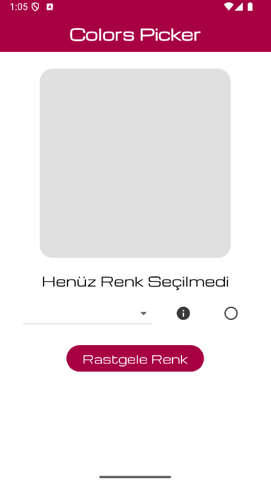
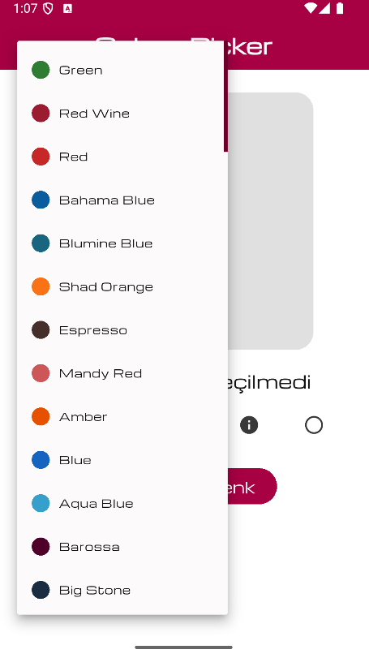
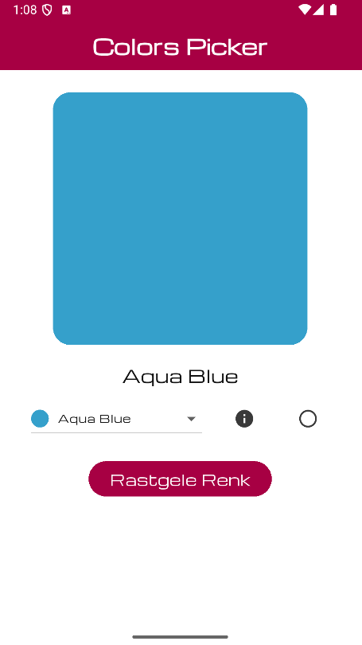
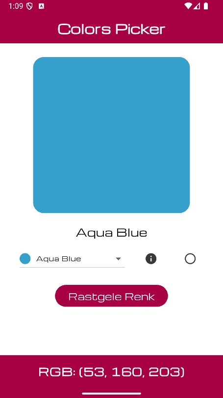
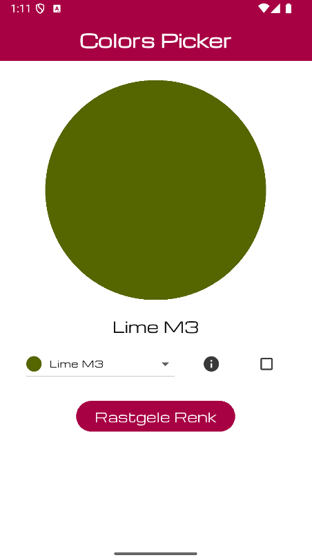

# 🎨 Color Picker App
Bu proje, Flutter’ın **flex_color_scheme** paketinde yer alan hazır renk temaları arasından seçim yapmanızı sağlayan kullanışlı bir arayüz sunar. Böylece yeni bir projeye başlamadan önce uygulamanız için en uygun renk temasını hızlıca belirleyebilirsiniz.

Uygulama, seçilen tema doğrultusunda arayüzdeki Container widget'ının arka plan rengini dinamik olarak günceller. Ayrıca, seçilen rengin RGB kodu bir SnackBar aracılığıyla kullanıcıya gösterilir. Böylece hem görsel bir önizleme hem de teknik renk bilgisi sunulmuş olur.

## ✨ Özellikler
- ✅ flex_color_scheme paketinde yer alan hazır tema renklerini listeleme
- 🎨 Seçilen temaya göre arayüzdeki Container rengini dinamik olarak güncelleme
- 📋 Seçilen rengin RGB (Red-Green-Blue) kodunu SnackBar ile gösterme
- ⚡ Hızlı ve kullanıcı dostu tema önizleme imkânı

## 🔧 Kullanılan Paketler
- **flex_color_scheme: ^8.2.0** – Gelişmiş tema ve renk yönetimi
- **google_fonts: ^6.2.1** – Google yazı tiplerini projeye ekleme
- **flutter_riverpod: ^2.6.1** – Durum yönetimi (state management)
- **go_router: ^15.2.0** – Sayfalar arası yönlendirme yönetimi

## 📱 Ekran Görüntüleri

### Uygulama Başlangıcı

Uygulama açıldığında kullanıcıya ilk görüntü.

### Renklerin Dropdown Menüsü

flex_color_scheme paketindeki renk temalarının listelendiği dropdown.

### Seçilen Rengin Görünümü

Dropdown menüden ya da rastgele renk butonundan seçim yapıldığında rengin görünümü.

### RGB Kodunun SnackBar ile Gösterimi

İnfo ikonuna basarak seçilen rengin RGB kodunun SnackBar ile gösterilmesi.

### İkon Butonla Container Şekli Değiştirme

İkon buton() kullanılarak, rengin gösterildiği Container'ın şeklinin daire veya kare olarak değiştirilmesi.
